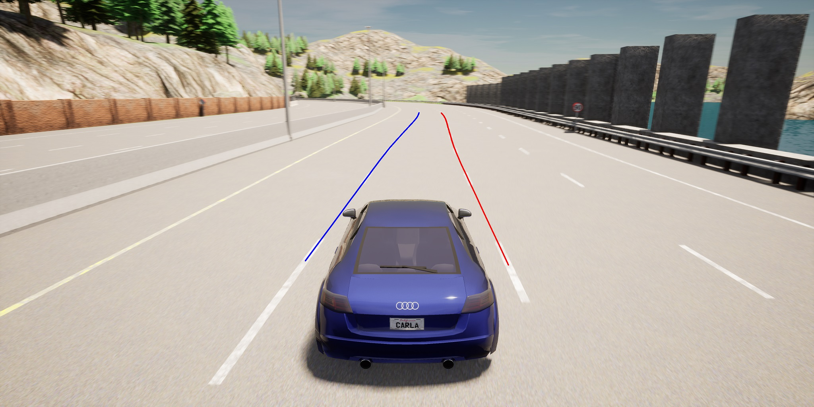

# This folder needed for research purposes.

## Literature I used for analysis.
- [art-cordic-fisheye.pdf](./art-cordic-fisheye.pdf) - article about mathematical correction of the fisheye lens effect.
- [Test pathes.ipynb](./Test%20pathes.ipynb) - Jupyter notebook, used for analysis of best algorithms for predicting robot's paths
- [Autonomous driving](https://thomasfermi.github.io/Algorithms-for-Automated-Driving/Introduction/intro.html) - Guides for building a software for car autopilot
- [imx219](https://github.com/raspberrypi/linux/blob/rpi-4.19.y/drivers/media/i2c/imx219.c) - Camera drivers. I found for raspberry pi, but we could adjust them for our motherboard

## Implementation ideas
- ###  Predicting lines of the road (marking) and trying to build points by noms to them.
  
    This lines should be as smooth as possible, because finding norm for them will have shoulder much greater then the effect waving lines.

- ### For better precision I am thinking to implement the fisheye distortion correction.
    Main ideas is not to re-rendering the picture - this is simply takes too much resources. I would like to find out the function of the of ploting the points on the segmentation on the road plane and calculating in it's coordinates. This may require calibration of the camera time-to-time or before the usage. \
    \
    First idea was to implement this correction directly on ISP (image signal processor) on the camera. However imx219 camera does not have one. 

- ###